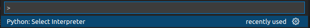
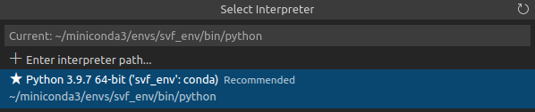

# SVF GCN Example

## Pre requisites

Install Miniconda [here](https://repo.anaconda.com/miniconda/Miniconda3-latest-Linux-x86_64.sh)

```bash
    sudo chmod +x ~/Downloads/Miniconda3-latest-Linux-x86_64.sh
    ./Miniconda3-latest-Linux-x86_64.sh
```

## How to run

```bash
    # If you have a GPU made by Nvidia, you can omit `cpuonly`
    conda create -n svf_env -c pytorch pytorch cpuonly
    
    conda activate svf_env

    conda install -c dglteam dgl

    pip install requests matplotlib
```

Press `Ctrl + Shift + P` and search `Python: Select Interpreter`, and find the python binary that was created for the svf_ex conda environment. If you do not see it, close and reopen the terminal or restart VSCode.






If using VSCode, `F5` key is already configured to run `main.py`. If you are not using VSCode, enter the following commands to run:

```bash
    export DGLBACKEND=pytorch
    python3 main.py
```